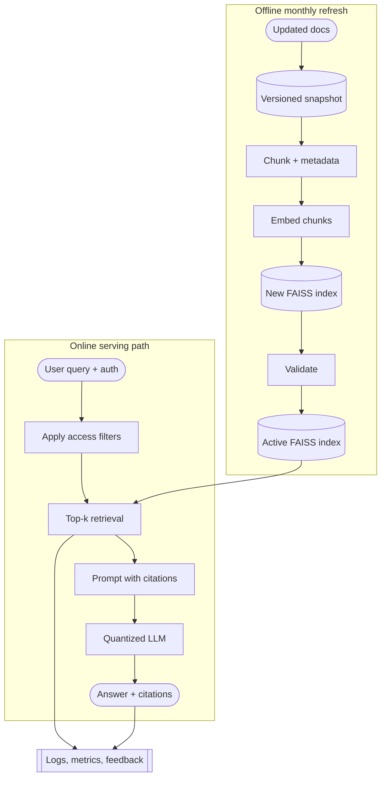

# Part A - System Design

## Problem framing
We need a low-latency internal document Q&A system for an on-prem environment. I assume users ask short factual questions over mostly text documents such as policies, SOPs, FAQs, and operational guides. With ~2,000 documents, monthly updates, and ~20 concurrent users, I would build a simple batch-refreshed RAG system that returns grounded answers with citations.

## Assumptions
- Users are internal staff asking natural-language questions about approved documents.
- Some documents may be department-specific, so retrieval must respect access rules.
- Monthly updates are acceptable, so freshness means the latest promoted index snapshot.
- "Snappy" means low p95 latency under peak load, not just fast single requests.
- Answers should be grounded in retrieved source passages, with citations returned to the user.

## Architecture overview
I would separate offline refresh from online serving so ingestion failures do not affect live queries. The document layer stores the approved monthly snapshot plus metadata such as title, source path, version, department, classification, and access rules. The refresh job parses documents, chunks text with this metadata, generates embeddings with a lightweight embedding model, rebuilds a local FAISS index offline, then validates and promotes it as the active index. The previous snapshot/index remains available for rollback, so a bad refresh does not require emergency reprocessing while users are waiting.

The online path is a small query service behind the existing API gateway. It authenticates the user, converts the question to an embedding, applies department or document-level access filters, searches the active FAISS index for top-k permitted chunks, and builds a prompt containing only those passages plus citation metadata. The prompt is sent to a quantized LLM served on the shared GPU cluster. The user receives a concise answer with citations; logs, metrics, and feedback are captured for monitoring and evaluation. This keeps the latency-sensitive path small: auth, retrieval, prompt construction, generation, and response.

## Key decisions and tradeoffs
- **RAG instead of training the model on the document corpus:** documents change monthly and answers need source attribution. Keeping knowledge in a versioned retrieval layer is easier to refresh and cite; tuning the model would make updates slower and stale memorized answers harder to diagnose.
- **FAISS instead of a full vector DB:** after chunking, this is still a small corpus. A local FAISS index plus a metadata store is fast and on-prem friendly without operating another service. I would move to a vector DB only for much larger scale, frequent updates, or complex filtering. A pure NumPy cosine search would also work initially, but FAISS gives headroom with little extra operational cost.
- **Access-filtered retrieval:** because multiple departments share the endpoint, retrieval should only search documents the user is allowed to see, based on department or document-level metadata. Filtering before prompt construction is important: the LLM should never receive restricted passages and then be trusted not to reveal them.
- **Small quantized model instead of a larger model:** the GPU cluster is shared, so the model should optimize for latency, tokens/sec, and predictable concurrency rather than maximum benchmark quality. For this use case, the model mainly synthesizes retrieved evidence; it does not need to memorize the corpus.
- **Batch refresh instead of real-time indexing:** monthly updates do not justify streaming ingestion. Versioned snapshots, validation, promotion, and rollback give consistency with less operational burden. I would add real-time indexing only if document updates became frequent or users needed same-day freshness.

## Post-deployment monitoring
Monitoring should validate the design assumptions. For the "snappy" requirement and shared GPU constraint, I would track p95/p99 latency, throughput, queue depth, timeouts, and GPU utilization. For the RAG choice, I would track retrieval quality: empty-retrieval rate, top-k recall on a small labeled set, citation coverage, and drift on a replay set of recent queries. For the batch refresh and multi-department assumptions, I would track index age, refresh success, rollback frequency, and per-department retrieval/access-filter patterns.

## Production-only failure mode
A likely production-only failure is cross-department semantic collision. In test data, retrieval may look good, but real users may ask underspecified questions like "What is the approval process?" while several departments have similarly named policies. The system could retrieve plausible chunks from the wrong department, causing irrelevant answers or, if filtering is too late, restricted-source exposure. I would mitigate this with pre-generation access filtering, citations, per-department retrieval monitoring, and replay tests using anonymized real queries after each refresh.
